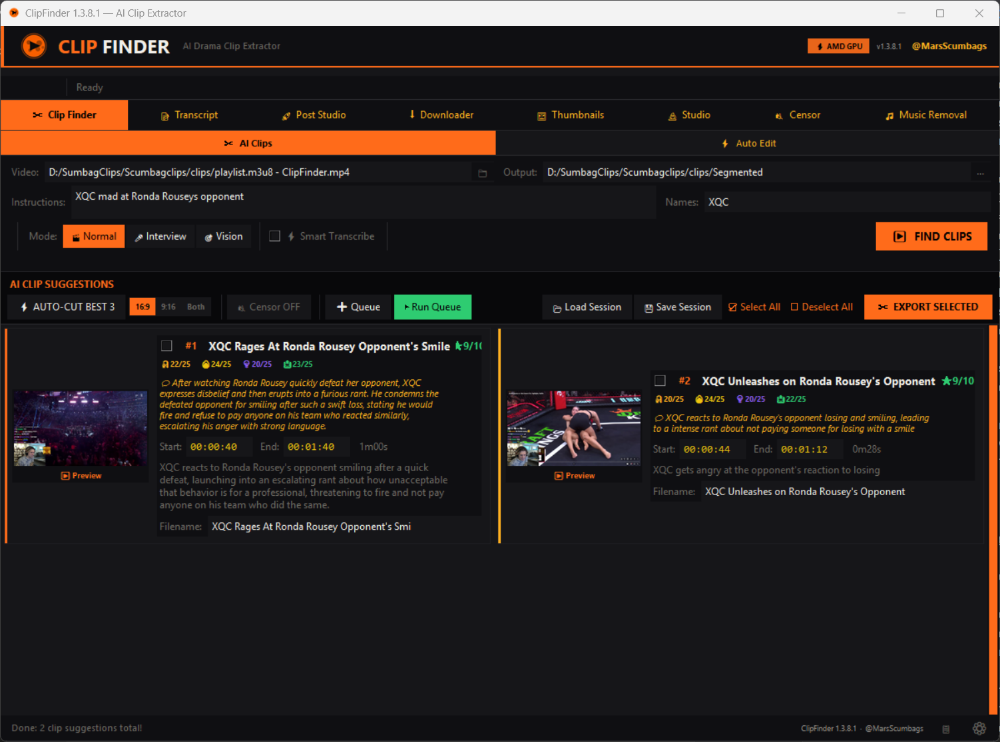
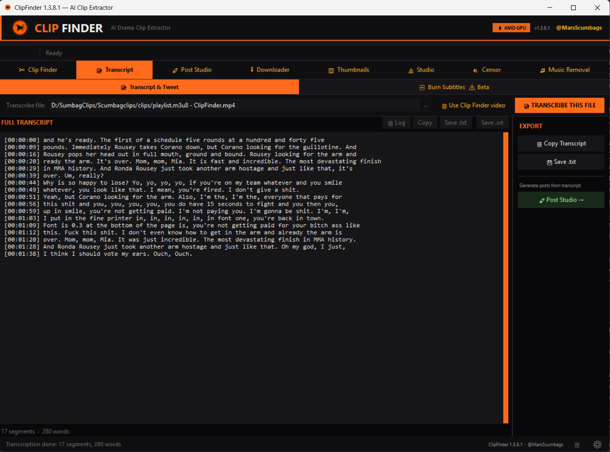
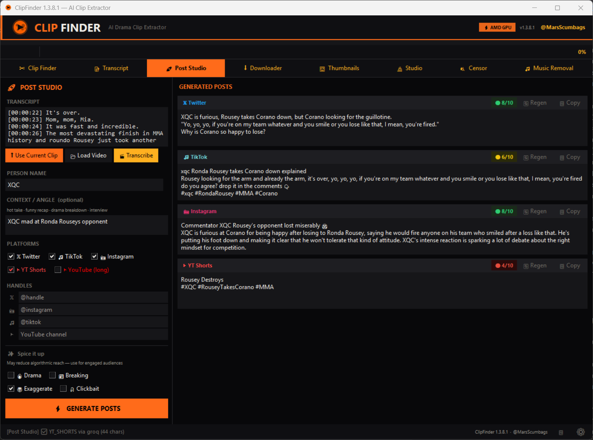
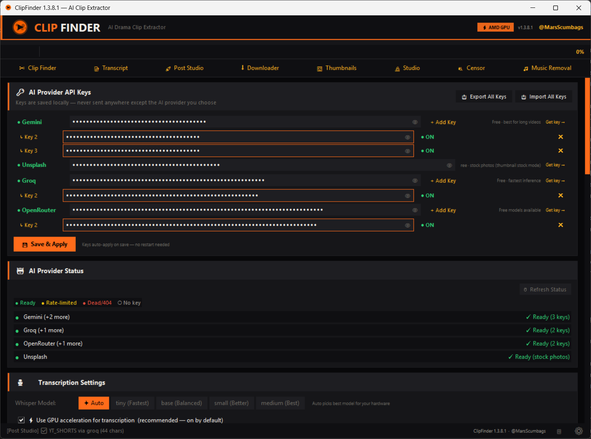

# ClipFinder
**AI-powered drama clip extractor for streaming content**  
*by [@MarsScumbags](https://x.com/MarsScumbags)*

ClipFinder automatically finds, cuts, censors, and exports viral clips from streaming VODs using AI. Built for drama/streaming content creators — paste a VOD URL, pick a clip length, and let it do the work.

---

## Screenshots

---

## Features

- **AI Clip Extraction** — finds the most viral-worthy moments using Groq, Gemini, or OpenRouter
- **Post Studio** — generates algo-optimized posts for X, TikTok, Instagram, YouTube Shorts, and YouTube from clip transcripts, with per-platform scoring and regen
- **Transcript** — whisper.cpp transcription with word-level timestamps, GPU acceleration
- **Censor** — auto-detects and bleeps banned words, AI-assisted filtering
- **Music Removal** — separates vocals/music using Demucs before transcribing
- **Studio** — duplicate detection, upscaling, batch export
- **Thumbnails** — AI thumbnail search and download
- **Downloader** — yt-dlp powered VOD downloader built in

---

## Download & Install

1. Go to [**Releases**](https://github.com/thatspeedykid/clipfinder/releases/latest)
2. Download `ClipFinder-Setup.exe`
3. Run the installer — no admin rights needed
4. Launch ClipFinder and add your AI API keys in Settings

The installer bundles Python, whisper.cpp, and all required packages. Everything works out of the box — no manual setup.

---

## AI Providers

ClipFinder uses free AI APIs for clip analysis and post generation. Add keys in **Settings → AI Keys**.

| Provider | Use | Get Key |
|---|---|---|
| [Groq](https://console.groq.com) | Clip analysis (primary), Post Studio | Free |
| [Google Gemini](https://aistudio.google.com/apikey) | Transcription backup | Free |
| [OpenRouter](https://openrouter.ai/keys) | Fallback, 50+ free models | Free |

All providers are free — no credit card required.

---

## Auto-Updates

ClipFinder checks for updates on launch. When a new version is available you'll see a banner — click to update. The app downloads and installs the new version automatically, no reinstall needed.

---

## Requirements

- Windows 10 or 11
- 4GB RAM minimum (8GB+ recommended for GPU transcription)
- NVIDIA GPU optional (faster transcription via CUDA)

---

## Links

- **X / Twitter:** [@MarsScumbags](https://x.com/MarsScumbags)
- **GitHub:** [thatspeedykid/clipfinder](https://github.com/thatspeedykid/clipfinder)
- **Issues:** [Report a bug](https://github.com/thatspeedykid/clipfinder/issues)
