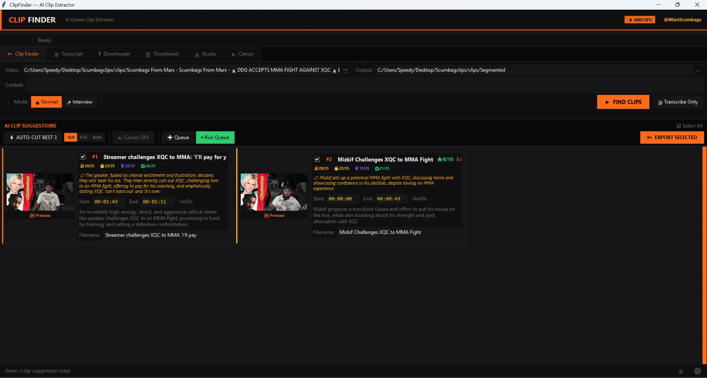

<div align="center">


# ClipFinder — AI Drama Clip Extractor

**Find, cut, and caption viral moments from any stream or video — automatically.**

[](https://github.com/thatspeedykid/clipfinder/releases/latest)
[](https://github.com/thatspeedykid/clipfinder/releases/latest)
[](LICENSE)
[](https://x.com/MarsScumbags)



</div>

---

## What is ClipFinder?

ClipFinder is a Windows desktop app that uses AI to automatically find the best drama, tea, and highlight moments in stream VODs and videos. Point it at any video, hit Find Clips, and get timestamped clips scored for virality — ready to export as 16:9 or 9:16 vertical for TikTok/Reels.

Built by [@MarsScumbags](https://x.com/MarsScumbags) for drama clip channels.

---

## Features

- 🤖 **AI Clip Detection** — Gemini, Groq, and OpenRouter find the best moments automatically
- 🎬 **Hybrid Detection** — FFmpeg audio energy analysis + AI for smarter clip selection
- ✂️ **Smart Export** — 16:9, 9:16 vertical, or both simultaneously with GPU acceleration
- 🎙️ **GPU Transcription** — whisper.cpp with Vulkan for AMD/Intel, CUDA for NVIDIA
- 🔇 **Auto Censor** — beep, silence, or custom MP3 over banned words
- ⬇️ **Built-in Downloader** — Kick, Twitch, YouTube, Twitter/X via yt-dlp
- 🖼️ **Thumbnail Finder** — Unsplash + Google Images fallback
- 🐦 **Tweet Generator** — AI-written viral tweets with Drama/Tea/Breaking/Hype tones
- 🎬 **Studio** — AI upscaling (EDSR 4x), image enhancement
- 📺 **Interview Mode** — multi-speaker clip detection
- 🔔 **Update Checker** — silent check on launch, notifies when new version available
- ☕ **Support link** in Settings

---

## Download

**[⬇ Download ClipFinder_Setup.exe — Latest Stable Release](https://github.com/thatspeedykid/clipfinder/releases/latest)**

> Looking to test the latest features? Grab the **[v1.2 Beta Pre-release](https://github.com/thatspeedykid/clipfinder/releases/tag/v1.2-beta)** — VOD mode, Auto Edit, Smart Whisper and more.

- Windows 10/11 64-bit only
- No Python required — everything included
- ~110MB installer

---

## First Time Setup

1. Run `ClipFinder_Setup.exe` → installs to AppData + Desktop shortcut
2. Open ClipFinder
3. Go to **⚙ Settings → API Keys** and add your keys (all free):

| Provider | What It's For | Free Tier | Get Key |
|----------|--------------|-----------|---------|
| **Gemini** | Clip finding — best for long videos | 15 req/min | [aistudio.google.com/apikey](https://aistudio.google.com/apikey) |
| **Groq** | Tweets + fast inference | 30 req/min | [console.groq.com](https://console.groq.com) |
| **OpenRouter** | Fallback + extra free models | Varies | [openrouter.ai/keys](https://openrouter.ai/keys) |
| **Unsplash** | Thumbnail search | 50 req/hr | [unsplash.com/oauth/applications](https://unsplash.com/oauth/applications) |

> You only need one AI key to get started. Groq or Gemini recommended.

4. Click **Save & Apply** — no restart needed

### How to get each API key

<details>
<summary><b>🔑 Gemini (Google) — Best for clip finding</b></summary>

1. Go to [aistudio.google.com/apikey](https://aistudio.google.com/apikey)
2. Sign in with your Google account
3. Click **Create API Key**
4. Paste into ClipFinder → Settings → Gemini

Free tier: 15 requests/min, 1500 requests/day.
</details>

<details>
<summary><b>🔑 Groq — Best for tweets</b></summary>

1. Go to [console.groq.com](https://console.groq.com)
2. Sign up → **API Keys** → **Create API Key**
3. Paste into ClipFinder → Settings → Groq

Free tier: 30 requests/min — fastest inference available.
</details>

<details>
<summary><b>🔑 OpenRouter — Free models fallback</b></summary>

1. Go to [openrouter.ai](https://openrouter.ai)
2. Sign up → **Keys** → **Create Key**
3. Paste into ClipFinder → Settings → OpenRouter

Free tier: multiple free models, no credit card needed.
</details>

<details>
<summary><b>🔑 Unsplash — Thumbnail search (optional)</b></summary>

1. Go to [unsplash.com/oauth/applications](https://unsplash.com/oauth/applications)
2. Sign in → **New Application** → accept terms
3. Copy your **Access Key**
4. Paste into ClipFinder → Settings → Unsplash

Free tier: 50 requests/hour.
</details>

### Optional but recommended
- **Settings → Core Dependencies → Install ffmpeg** (auto-downloads)
- **Settings → Core Dependencies → Install whisper.cpp (GPU)** — AMD/Intel GPU transcription

---

## How to Use

### Find Clips
1. Paste a URL or browse to a video file
2. Add context (who's in it, what's the drama)
3. Hit **▶ FIND CLIPS**
4. Review AI suggestions, adjust timestamps if needed
5. Select clips → **✂ EXPORT SELECTED**

### Generate Tweet
1. Transcribe your video first
2. Go to **📝 Transcript** tab
3. Add context, pick a tone (Drama / Tea / Breaking / Hype)
4. Hit **⚡ GENERATE TWEET**

### Censor Audio
- Toggle **🔇 Censor** in the export bar
- Choose Beep, Silence, or custom MP3
- Manage word list in the **🔇 Censor** tab

---

## GPU Transcription

| GPU | Method | Speed |
|-----|--------|-------|
| AMD (RX 5000+) | whisper.cpp + Vulkan | ~10x realtime |
| Intel Arc / iGPU | whisper.cpp + Vulkan | ~5x realtime |
| NVIDIA | faster-whisper + CUDA | ~15x realtime |
| Any CPU | faster-whisper int8 | ~3x realtime |

Install via **Settings → Core Dependencies**.

---

## What's Coming in v1.2

> Currently in beta — [download here](https://github.com/thatspeedykid/clipfinder/releases/tag/v1.2-beta)

- 📼 **VOD Mode** — Twitch/Kick/YouTube full VODs download to a separate `vod/` folder with 8x parallel fragment downloading for massive speed improvements on 10GB+ files
- 🎬 **Auto Edit Mode** — CapCut-style automatic editing using silence detection, audio energy peaks, and AI clip selection — just hit go
- 🎙️ **Smart Auto Whisper** — automatically picks the best model size based on video duration and your GPU
- 🐛 Bug fixes: output location persisting, transcript tab improvements, mediapipe face tracking update, provider order

---

## Building from Source

Requires Python 3.12.

```bash
git clone https://github.com/thatspeedykid/clipfinder
cd clipfinder
pip install -r requirements.txt
python clipfinder.py
```

To build the installer (requires Python 3.12 + [NSIS](https://nsis.sourceforge.io)):
```bash
build_installer.bat
```

---

## Changelog

### v1.1 — April 2026 — Current Stable
- Hybrid clip detection (FFmpeg audio energy + AI)
- In-app update notifications
- Donate button in Settings
- App icon in header
- Both export (16:9 + 9:16) fixed for regular and censor export
- Browse buttons for output/download folders in Settings
- imagehash detection fixed
- Permission errors on Update All fixed
- Whisper auto model fixed
- Cookies status live-updating in Downloader

### v1.0 — April 2026 — Initial Release
- AI clip detection (Gemini, Groq, OpenRouter)
- GPU transcription (AMD/Intel Vulkan, NVIDIA CUDA)
- 16:9 and 9:16 export with face tracking
- Built-in downloader (Kick, Twitch, YouTube, Twitter/X)
- Tweet generator, auto-censor, thumbnail finder
- Studio tab, Interview mode, one-click dependency installer

---

## Support

If ClipFinder helps your channel, consider buying me a coffee!

[](https://www.paypal.com/donate/?business=networkchasemedia%40gmail.com&currency_code=USD)

Follow for clips and updates: [@MarsScumbags](https://x.com/MarsScumbags)

---

## License

MIT — free to use, modify, and distribute. Credit appreciated.
